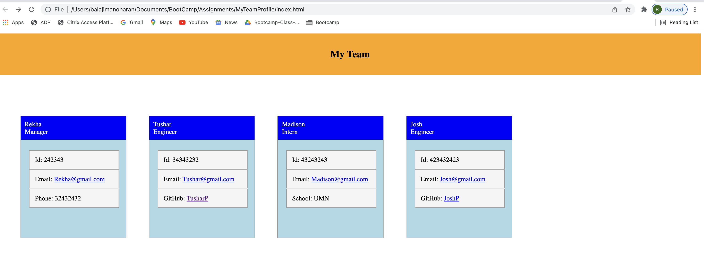

# # Description

Project Description: This functionality helps the team to generate an webpage (html) with the following team details using node js

Manager - Name, role, Email id, office number
Intern- Name, role, Email id, School
Engineer- Name, role, Email id, Github

## Screenshot

## GitHub Repo

Functionality Recording: 

## Usage

Go to the terminal > enter node index.js
Enter the answer for the manager questions
Choose Engineer/Intern and answer questions
The user can add as many Engineer/Intern as he/she wants
Open index.html page to view the details in the webpage

## Support

N/A

## Roadmap

Addition roles and UI can be modified based on the user needs

## License

N/A

## Project Status

Baseline project completed. Additional enhancements can be done based on the user feedback.

