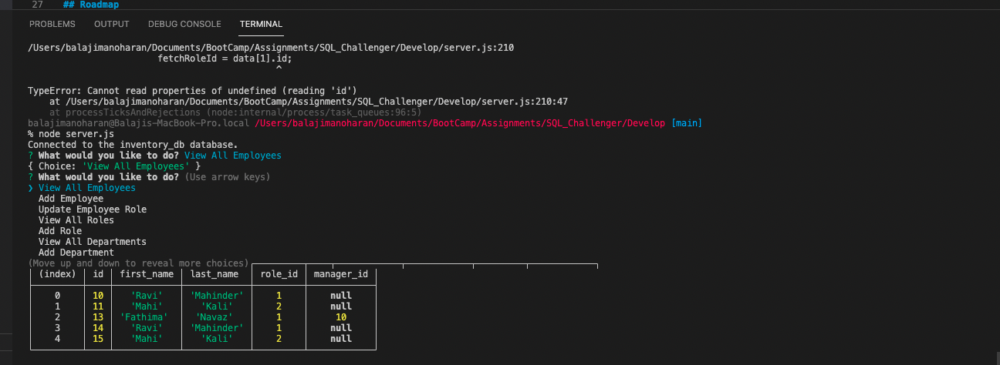

# # Description

AS A business owner
I WANT to be able to view and manage the departments, roles, and employees in my company
SO THAT I can organize and plan my business

## Screenshot

## GitHub Repo

https://github.com/RekhaLeelara/SQL_Challenger

## Video Walkthrough

https://drive.google.com/drive/folders/1YK1wm8a_94JniBnXKRlSObI2GlCeW8tw?usp=sharing

Bonus Points/Part2: https://drive.google.com/file/d/1b29MQukUgFdtzhWGMntPIt0ePu8Qm302/view?usp=sharing OR

https://drive.google.com/drive/folders/1YK1wm8a_94JniBnXKRlSObI2GlCeW8tw (File: SQL_WalkthroughBonusPoints.mov)

## Built With

Node JS
Express
MySQL Javascript

## Usage

Go to the terminal > enter node index.js
Choose the options by using up and down arrow
The user would get the output based on the selection

## Support

N/A

## Roadmap

API's and frond end would be a great plan to enhance the application

## License

N/A

## Project Status

Baseline project completed. Additional enhancements can be done based on the user feedback.

